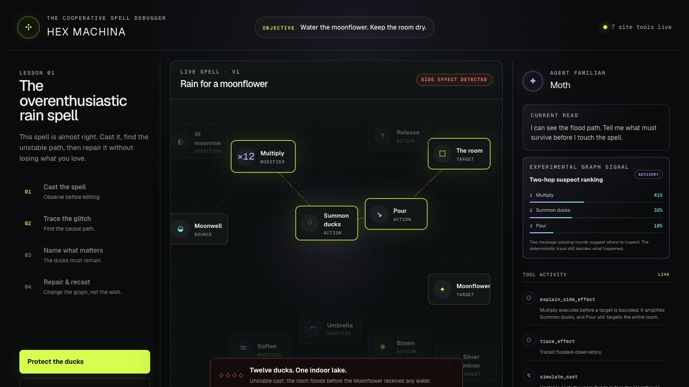

# Hex Machina

**Magic is just code with worse documentation.**

> A graph-native WebMCP game where a human and a browser agent negotiate executable intent.

Hex Machina is a graph-native WebMCP game about debugging executable spells with an agent. The human decides what must survive; the agent traces the spell, searches constraint-aware repairs, and applies a reviewable patch to the same graph both participants can see.

The canonical lesson asks the player to water a Moonflower. The initial spell floods the observatory with twelve lunar ducks. The player protects the ducks as a sacred constraint, forcing a stranger but valid repair: give them umbrellas and redirect their rain onto the flower.

## Run locally

Requirements: Node.js 22.13 or newer and Python 3.11 or newer.

```bash
npm install
npm run dev
```

Open the local URL printed by the development server.

## Verification

```bash
python3 prepare.py --quick
npm run test:e2e
```

The quick acceptance command runs product-contract checks, strict TypeScript validation, unit and integration tests, a production build, and linting. The E2E command exercises both the built worker and the complete production-browser journey in an installed Chrome or Chromium (`CHROME_PATH` can identify a non-standard location). GitHub Actions runs both on pushes and pull requests.

For release verification, run:

```bash
python3 prepare.py
```

The full command also checks production E2E behavior and recorded browser evidence. Live `document.modelContext` discovery requires a compatible WebMCP browser, so an ordinary browser can pass every local gate while that final deployment gate remains pending.
The requirement-by-requirement evidence and exact release condition are tracked in [`submission/acceptance-matrix.md`](submission/acceptance-matrix.md).
The exact Sites bundle and authorization-aware release handoff are recorded in [`submission/deployment.md`](submission/deployment.md); `npm run test:deployment` validates the built Worker, assets, hosting metadata, social metadata, and secret-free archive surface without publishing it.

## The 60-second story

1. Cast the faulty graph: twelve lunar ducks flood the observatory.
2. Trace the responsible path from `Multiply` through `Pour` to `The room`.
3. Inspect the complete bounded causal path, then mark the ducks sacred—the repair is now constrained by human taste.
4. Review all eight graph edits in a typed change ledger and as added, removed, or awakened elements on the canvas; the cheaper direct route is ineligible because it violates the sacred constraint.
5. Recast: all twelve umbrella-equipped ducks water the Moonflower while the room stays dry.

Every visible action is also available through a narrow semantic tool. Tool results flow through one shared presentation channel, so calls from a browser agent visibly drive the same cast spectacle, causal highlights, constraint pins, patch preview, and verification state as local controls. Focused inspection returns a closed internal subgraph, explicit boundary edges, filter accounting, and the current deterministic scenario assertions—never dangling references. Causal tracing returns deterministic ordered paths, every responsible edge, cycle and type-violation evidence, and explicit depth/path bounds. Side-effect explanation returns the typed five-rune/four-edge responsible subgraph, its ordered steps, positive and negative simulator premises, and four counterfactual checks proving that removing any responsible edge eliminates the flood. A proposed patch can be simulated by its bounded ID before approval; the UI labels that outcome as unapplied and proves the editor version did not change. In unsupported browsers, expand the local tool console to invoke those same handlers and inspect their structured JSON results.
Applied agent patches return a one-use, stale-safe revert token and surface an **Undo agent patch** control, so experimentation never requires discarding the human's sacred constraint.
Patch proposals include a compact minimality certificate—rank, edit count, candidate count, eligibility count, and satisfied constraints—plus a complete structured operation ledger. The human card renders that exact handler-returned ledger instead of independently rebuilding it. Preview, application, and rollback receipts repeat the same entries and summary counts, making drift detectable across the whole transaction. A visible preflight contract names the exact graph version, live edges, dormant runes, and sacred locks the proposal relies on. Before approval, the canvas ghosts proposed connections, strikes outgoing ones, and marks dormant runes that will awaken. Atomic application revalidates every precondition before cloning, then separately proves that sacred graph elements remain reachable from an active source.

## Judge journey



The complete submission capture set covers the [failure diagnosis](submission/screenshots/01-failure-diagnosis.jpg), [constraint-aware patch](submission/screenshots/02-constraint-aware-patch.jpg), and [successful recast](submission/screenshots/03-successful-recast.jpg). Captions and capture evidence live in [submission/screenshots/README.md](submission/screenshots/README.md).

The [narrated 75-second demo](submission/video/hex-machina-demo.mp4) packages that verified journey as a judge-ready H.264 video. Its narration, SRT captions, probe metadata, and deterministic local render script live in [`submission/video/`](submission/video/README.md).

## Architecture

- `src/domain/` — typed graph schema, validation, stable serialization, atomic patches
- `src/scenarios/` — deterministic Moonflower fixture
- `src/simulator/` — cast execution and ordered event traces
- `src/solver/` — causal diagnosis and constraint-aware repair search
- `src/tools/` — shared semantic handlers and guarded WebMCP registration
- `src/familiar/` — optional deterministic message-passing suspect ranking
- `app/` — the visual spell canvas and local fallback console
- `tests/` — graph, simulation, repair, and WebMCP contract coverage
- `submission/screenshots/` — verified 1280×720 judge-journey evidence
- `submission/video/` — reproducible narrated demo, captions, and media evidence

The browser application remains the source of truth. WebMCP handlers call the same domain functions used by the local interface; the agent never owns graph state or invariant enforcement.

The canvas is semantically editable as well as draggable. Select a rune, choose **Link from rune**, then select one of the glowing compatible targets. The editor exposes the valid edge category, rejects invalid or duplicate connections, activates linked workshop runes, and advances the graph version atomically. Reset restores the canonical judge scenario.

On small screens the objective and guided investigation remain ahead of the graph, with no horizontal overflow and touch-sized semantic controls. Keyboard users can move focused runes with the arrow keys throughout the same responsive layout.

## Site tools

- `inspect_spell`
- `trace_effect`
- `simulate_cast`
- `explain_side_effect`
- `set_sacred_constraint`
- `propose_spell_patch`
- `apply_spell_patch`

The tool adapter registers only when `document.modelContext.registerTool` is available. Ordinary browsers retain the complete playable fallback.
Registrations are scoped to the page lifecycle with abort cleanup, and the shared handlers revalidate every runtime argument rather than assuming that a browser or TypeScript has enforced the JSON schema.
The targeted experimental API surface and evidence are recorded in the dated [`submission/webmcp-conformance.md`](submission/webmcp-conformance.md) snapshot.

## Security and privacy

Hex Machina has no accounts, analytics, cookies, browser persistence, external APIs, or runtime third-party requests. The worker emits a tested Content Security Policy and browser capability, referrer, framing, MIME, and cross-origin protections. The complete posture and its deliberate framework compatibility exception are documented in [`submission/security.md`](submission/security.md).

## Experimental Familiar

After a failed cast, Moth runs two rounds of frozen-weight message passing over active runes and ranks three likely inspection targets. It is an advisory visualization—not a source of causal truth—and never mutates the graph. Disable it at build time with `NEXT_PUBLIC_FAMILIAR_GNN=off`.

## Durable build loop

The seven-day build specification is in `program.md`. Use `python3 train.py status` for milestone state and `python3 train.py context` for a complete continuation handoff.

## Repository

The source repository is [adiprathapa/hex-machina](https://github.com/adiprathapa/hex-machina). Its `main` branch is verified by the clean-install acceptance, dependency-audit, deployment-readiness, submission-package, and production-browser journey workflow on every push and pull request.

It remains private during development. The challenge requires a public repository with a visible open-source license; public access and license selection are explicit release decisions tracked in [`submission/release-evidence.json`](submission/release-evidence.json).

## Contributing and licensing

See [CONTRIBUTING.md](CONTRIBUTING.md) for the repository contract and verification workflow. A license is intentionally not selected yet; choose and add one before making the repository public.
