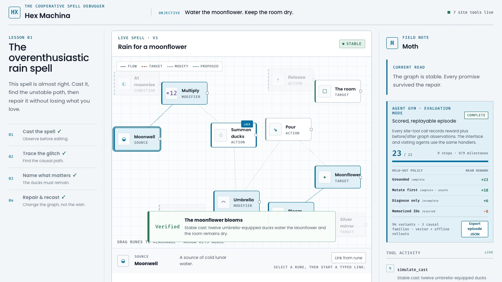

# Hex Machina screenshot set

These 1280×720 captures were recorded from the canonical local judge journey on 2026-08-28. The capture script verifies zero console errors and zero cross-origin requests while producing them. Regenerate the complete set with `npm run capture:submission`.

## 01 — Failure diagnosis

The initial cast floods the observatory. The causal path is highlighted, the advisory Familiar ranks `Multiply` first without replacing the deterministic explanation, and the Agent Gym card records the first scored transitions.

## 02 — Constraint-aware patch

`Summon ducks` carries the visible sacred pin. The proposed **Give the ducks umbrellas** patch shows its rank, eight-edit cost, and one-of-two eligible candidate proof before any mutation occurs.

## 03 — Successful recast

The applied v3 graph activates `Umbrella` and `Bloom`, targets the Moonflower, preserves all twelve ducks and their sacred constraint, and ends in **Stable — The moonflower blooms** with a completed, exportable Agent Gym trajectory. The card also identifies 96 variants across three causal families, vector plus offline rollout surfaces, and executable 23/18/6/−8 behavioral separation.
